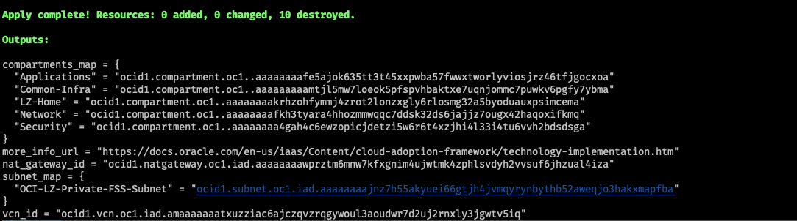
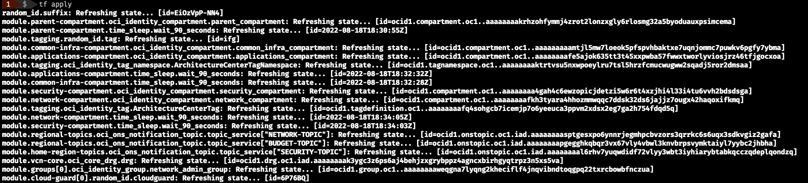

# Deploying the Workload Expansion 

1. Deploy the Baseline stack found [here](https://github.com/oci-landing-zones/oci-enterprise-scale-baseline-landing-zone). The Workload Expansion can not be deployed as a stand-alone. It builds on top of the Enterprise Scale Baseline Landing Zone adding a minimal baseline for a workload.

2. Create a terraform.tfvars file and populate with the required variables or override existing variables. Note: An example tfvars file is included for reference. Using this file is the preferred way to run the stack from the CLI, because of the large number of variables to manage. 

    - To use this file just copy the example tfvars file and save it in the outermost directory.
    - Next, rename the file to `terraform.tfvars`
    - You can override the example values set in this file.

    ```
    # PROVIDER
    region               = "us-phoenix-1"
    tenancy_ocid         = "ocid1.tenancy.oc1..aaaaaaaaaaaaaaaaaaaaaaaaaaaaaaaaaaaaaaaaaaaaaaaaaa"
    current_user_ocid    = "ocid1.user.oc1..aaaaaaaaaaaaaaaaaaaaaaaaaaaaaaaaaaaaaaaaaaaaaaaaa"
    api_fingerprint      = "a1:b2:c3:4d:5e:6f:7g:8h:99:10:aa:bb:11:12:13:cc"
    api_private_key_path = "~/path_to_example_api_key.pem"

    is_sandbox_mode_enabled = true
    tag_cost_center         = "example_tag_1"
    tag_geo_location        = "example_tag_2"

    # FIND IN COMPARTMENTS_MAP OUTPUT
    network_compartment_id      = "ocid1.compartment.oc1..aaaaaaaaaaaaaaaaaaaaaaaaaaaaaaaaaaaaaaaaaaaaaaaaa"
    applications_compartment_id = "ocid1.compartment.oc1..aaaaaaaaaaaaaaaaaaaaaaaaaaaaaaaaaaaaaaaaaaaaaaaaa"

    # CHOOSE A WORKLOAD NAME
    workload_compartment_name   = "workload-1"
    # FIND IN COMPARTMENTS_MAP OUTPUT
    network_compartment_name    = "network"

    # FIND IN VNC_ID AND NAT_GATEWAY_ID OUTPUT
    vcn_id         = "ocid1.vcn.oc1.phx.aaaaaaaaaaaaaaaaaaaaaaaaaaaaaaaaaaaaaaaaaaaaaaaaa"
    nat_gateway_id = "ocid1.natgateway.oc1.phx.aaaaaaaaaaaaaaaaaaaaaaaaaaaaaaaaaaaaaaaaaaaaaaaaa"

    # CHOOSE A VCN SUBNET CONFIGURATION
    private_subnet_cidr_block  = "10.0.2.0/24"
    private_subnet_dns_label   = "private0"
    database_subnet_cidr_block = "10.0.4.0/24"
    database_subnet_dns_label  = "database0"
    ```

3. For the following input variables, find the values in the outputs of the Baseline stack. This will allow you to use the networking and IAM resouces from the base.
   * network_compartment_id
   * applications_compartment_id
   * network_compartment_name
   * nat_gateway_id
   * vcn_id
    
    If you deployed the Baseline stack locally by running `terraform apply`, you should see the ouputs mentioned above.
    

    If you deployed the Baseline stack using Resource Manager you can click on the following: Stacks -> StackName -> Jobs -> JobName -> Outputs. This will display all the terraform outputs for the apply job.

4. Run `terraform plan` then `terraform apply` to provision the Workload Expansion. 
    

# Known Issues
